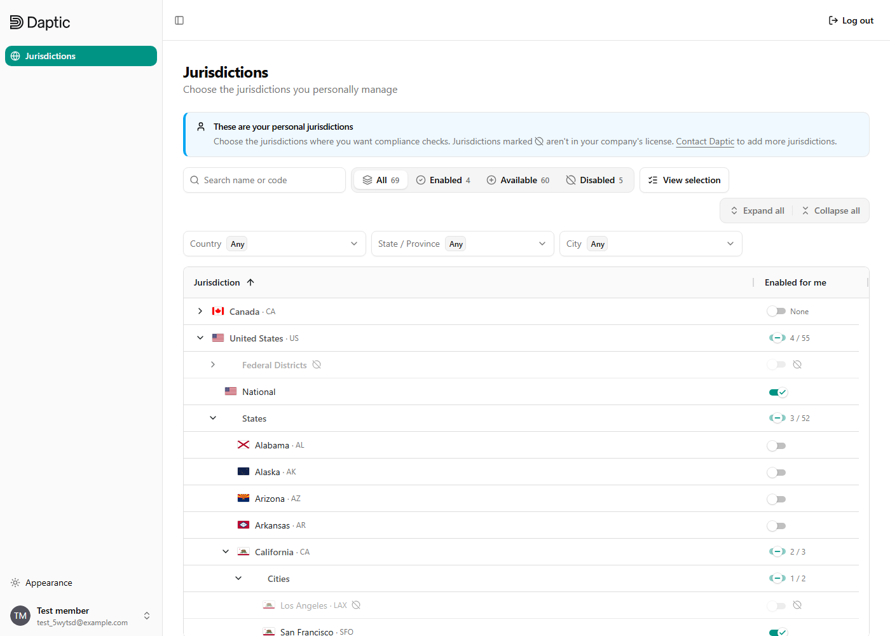
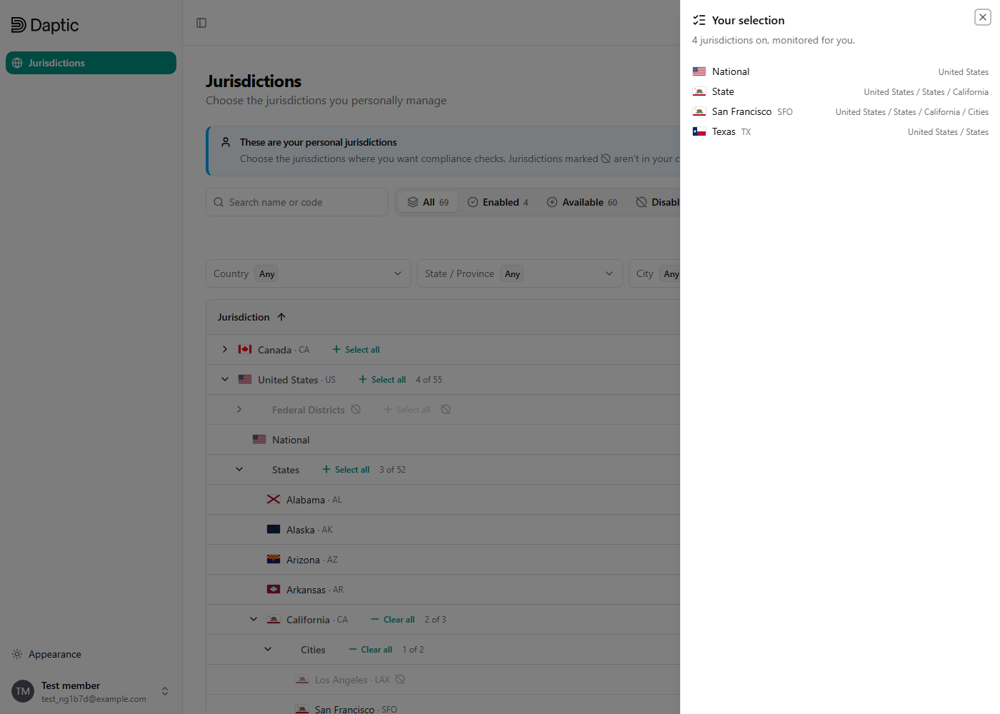
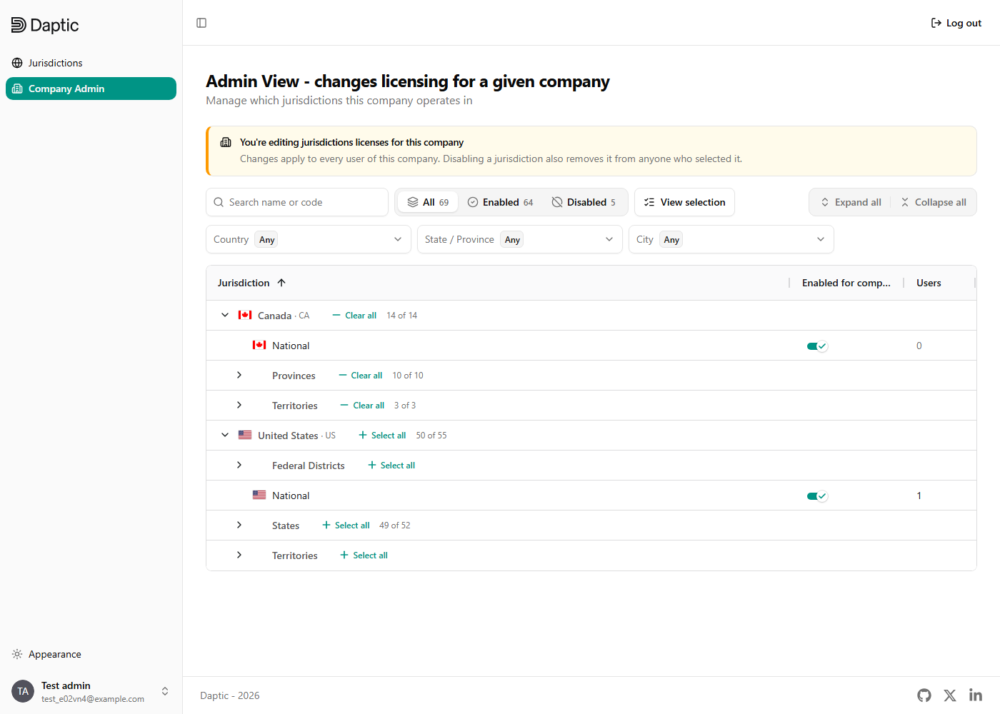

# Daptic: Jurisdiction Settings

This app lets each user choose which regulatory jurisdictions they monitor, within the set their organization has licensed. Jurisdictions outside the license stay visible but locked. Company admins get a second view where they change the license itself.



It is built on the [Full Stack FastAPI Template](https://github.com/fastapi/full-stack-fastapi-template): FastAPI, SQLModel and SQLite on the backend, and React, TypeScript, TanStack Router/Query and ag-grid on the frontend.

## Requirements

Install these first:

| Tool | Why | Install |
|---|---|---|
| [Git](https://git-scm.com/downloads) | Cloning the repo. On Windows, [Git for Windows](https://gitforwindows.org) also provides Git Bash, which runs the start scripts | `winget install Git.Git` on Windows; Xcode Command Line Tools on macOS (`xcode-select --install`) |
| [uv](https://docs.astral.sh/uv/getting-started/installation/) | Runs the backend and manages its Python packages | `powershell -ExecutionPolicy Bypass -c "irm https://astral.sh/uv/install.ps1 \| iex"` on Windows; `curl -LsSf https://astral.sh/uv/install.sh \| sh` on macOS and Linux |
| [Bun](https://bun.sh/docs/installation) | Runs the frontend and installs its packages | `powershell -c "irm bun.sh/install.ps1 \| iex"` on Windows; `curl -fsSL https://bun.sh/install \| bash` on macOS and Linux |

You don't need to install Python yourself. The backend needs Python 3.14, and `uv sync` downloads it if it's missing. The database is SQLite, which is a file, so there is no database server to install. The root `.env` already has working local defaults.

After installing uv and Bun, open a new terminal so it picks up the updated `PATH`.

## Running locally

The start scripts are bash. On Windows, run them from Git Bash. In VS Code, choose **Git Bash** from the dropdown next to **+** in the terminal panel. Typing `bash` in PowerShell opens WSL instead, which can't see your Windows `uv` or `bun`.

**Backend.** From the project root, run the start script. It installs dependencies, migrates and seeds the database, and starts the server. It's safe to rerun: seeding only happens on first setup.

```bash
./start_backend.bash
```

**Frontend.** From the project root, in a second terminal, run the start script. It installs dependencies and starts the dev server at http://localhost:5173.  Please wait about ~10 seconds after launching the backend to start the front end.  

```bash
./start_ui.bash
```

Log in as `admin@example.com` / `changethis` (Or create a new user). This user is an admin of the seeded company, so they see both **Jurisdictions** (their own selection) and **Company Admin** (the company's license).  

To reset the data, stop the backend, delete `backend/app.db`, and run `./start_backend.bash` again. More detail is in [development.md](development.md).

## What I built

### The two layers

| Layer | Who changes it | Where | Stored in |
|---|---|---|---|
| Company license | Company admins | Company Admin page | `companyjurisdiction` |
| Personal selection | Each user | Jurisdictions page | `userjurisdiction` |

The seed applies the PRD's plan to the default company: all of Canada, US National, every state except Wyoming and Utah, and San Francisco as the only city. Everything else (Wyoming, Utah, Los Angeles, Federal Districts, US Territories) is visible but locked.

### Data model

- **`jurisdiction`** is an adjacency list (`parent_id`) plus a materialized `path` of ancestor ids, so a whole subtree is one indexed prefix query. Each row also has `depth`, `sort_order` (keeps the source order), `name_path` (a readable breadcrumb), `code` (ISO 3166 / UN/LOCODE) and `region_type`.
- **`is_structural`** rows ("States", "Provinces", "Cities") are grouping labels. They can never be selected, by the API or the UI, but their select-all switch covers everything beneath them.
- **The license is enforced by the database.** A user opt-in has composite foreign keys to `(user, company)` and to `(company, jurisdiction)` in the company's license. A user can't hold a jurisdiction their company hasn't licensed, and when the company drops one, the database cascades it away from every user.

### API

All routes are under `/api/v1`. The ones that matter for this feature:

| Endpoint | Purpose |
|---|---|
| `GET {owner}/jurisdictions` | The owner's selected ids, as `{ jurisdiction_ids, count, version }`, with the version as an `ETag` |
| `PATCH {owner}/jurisdictions` | Merge a change: `add`, `remove`, `add_subtrees`, `remove_subtrees`. `add_subtrees` skips rows the company has not licensed. `If-Match` is optional |
| `PUT {owner}/jurisdictions` | Replace the whole set (rejects unlicensed or structural ids). `If-Match` required |
| `DELETE {owner}/jurisdictions` | Clear the set. `If-Match` required |
| `POST /companies/{id}/jurisdictions/preview` | What a PATCH would add and remove, and which users would lose an opt-in. Nothing is written |
| `GET /service/users/{user_id}/jurisdiction-ids` | **For other services:** a plain array of a user's ids. Authenticates with an `X-API-Key` header (`SERVICE_API_KEY` in `.env`) or a superuser token. An inactive user, or a user of an inactive company, gets `[]` |
| `POST /views/jurisdiction-grid/rows` | One page of the flattened, filtered, sorted tree for the grid |
| `POST /views/jurisdiction-grid/facets` | Counts and filter options for the toolbar |
| `GET /jurisdictions/tree` | The whole tree as a flat list |

`{owner}` is `/users/me`, `/users/{user_id}` or `/companies/{company_id}`. A user's selection is limited to their company's license, and company writes need a company admin.

**Errors.** Every non-2xx response has the same body, `{ detail, code, context }`. Branch on `code` (for example `email_taken`, `version_mismatch`, `jurisdiction_has_licenses`), not on `detail`. Ids and counts go in `context`.

**Concurrency.** Each selection has a version, sent as the `ETag`. Send it back as `If-Match` and the write only lands if nobody changed the selection since you read it. Otherwise you get a 412 whose `context.version` is the current version, so re-read and retry. A company admin's confirm-disable flow previews the drop, shows the affected users, then sends the PATCH with the preview's version, so a license change made in the meantime can't slip through. Dropping a company license also bumps the version of every user who lost an opt-in, as does moving a licensed jurisdiction (`PATCH /jurisdictions/{id}` with `allow_licensed_move: true`).

### Frontend

- **Tree grid.** ag-grid's infinite row model loads the flattened tree from the server 100 rows at a time. Filtering, search, sorting and expansion all run on the server, so the page doesn't need the full tree. This is aimed at the thousands of jurisdictions production has.
- **Three-state switches.** Every parent row has a select-all switch that shows on, off or mixed, plus a count such as `49 / 52`. Locked jurisdictions are counted, so a subtree with locked rows never shows as fully on. One click turns on everything available.
- **Locked rows** are dimmed, carry a lock icon, and have a tooltip explaining why. For members, the tooltip offers a link to email their company admins.
- **Finding things.** There is search by name or code with match highlighting, status tabs (All / Enabled / Available / Disabled), and country, state and city filters.
- **"View selection"** opens a panel with a readable summary (fully selected subtrees collapse to "All …") and the raw JSON of ids, with the matching API endpoint and a copy button.

  

- **Company Admin** uses the same grid against the license, with a per-row count of users who opted in. Turning off something users rely on opens a confirmation that lists exactly who will lose it.

  

## Tests

```bash
# Backend: pytest, from backend/
uv run pytest

# End to end: Playwright, from frontend/, with the backend and Vite running
bunx playwright install chromium   # first time only
bunx playwright test jurisdictions
```

`frontend/tests/jurisdictions.spec.ts` covers the feature end to end. Each test creates its own company with the PRD plan and its own users, so tests can change licenses and run in parallel without affecting each other.

- **User view:** locked versus selectable rows, saving a single jurisdiction (checked again after a reload and through the API), select-all for a subtree with and without locked rows, the selection JSON matching the API, search and status filters, expand and collapse all, and members being kept out of Company Admin.
- **Company view:** the admin scope, dropping an unused jurisdiction, the confirmation when a member would lose one (cancel and confirm), and licensing a new jurisdiction so a member can then pick it.

## Next steps

- **Auth and tenancy.** The PRD allowed skipping auth. The template's JWT login is kept, but every user lands in one seeded company, and new users default to company *admin*. The default should be *member*, and companies need real onboarding.
- **Scale testing.** Paging, filtering and subtree toggles already run on the server, but nothing has been tested against a tree of thousands of rows. Load-test it and check the SQLite queries, then move to Postgres for production.
- **License changes over time.** Record who changed a company's license and when, notify users who lose an opt-in, and offer a "re-enable for everyone who had it" undo.
- **Accessibility pass.** The status tabs' accessible names come from their tooltips ("Jurisdictions you've turned on…") rather than their labels. Use `describeChild` on those tooltips, then do a full keyboard and screen-reader review of the grid.
- **Service API hardening.** Replace the single shared `SERVICE_API_KEY` with keys scoped per service, and add a bulk "ids for these users" endpoint for consumers that fan out.

## License

MIT, inherited from the Full Stack FastAPI Template.
