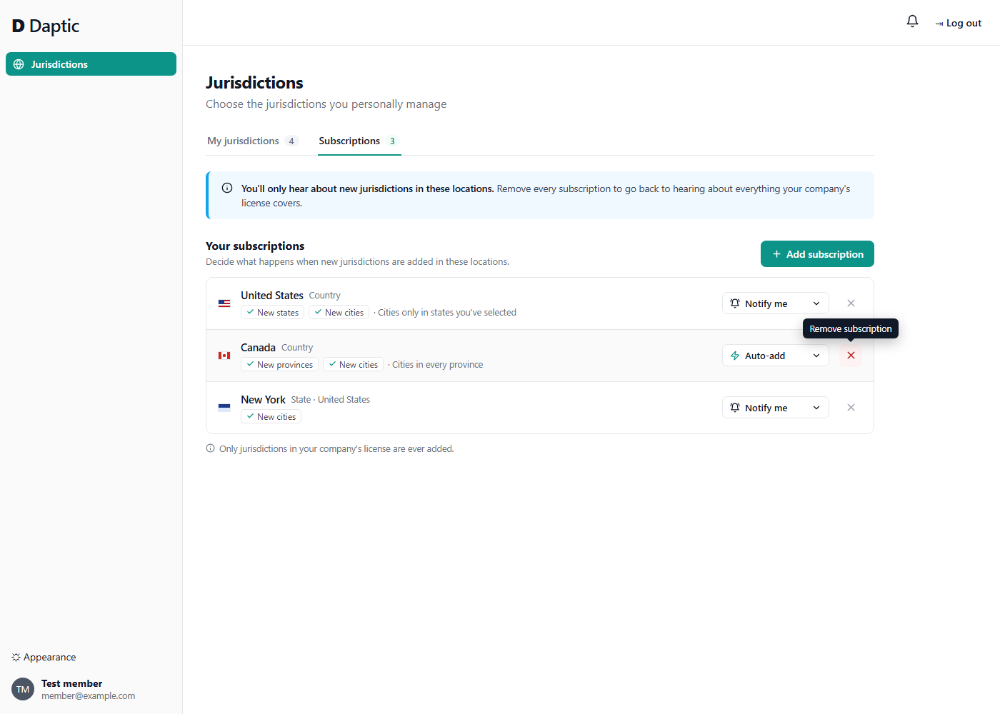
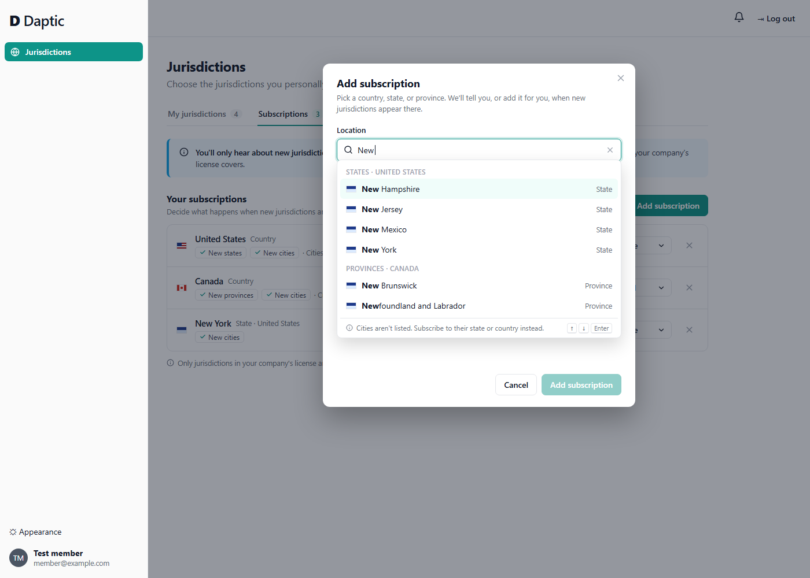
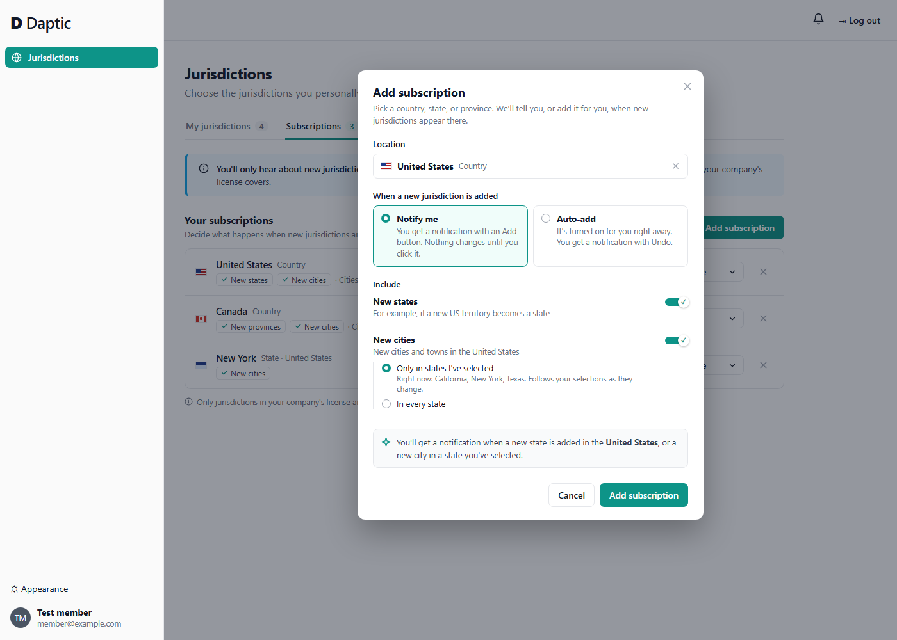
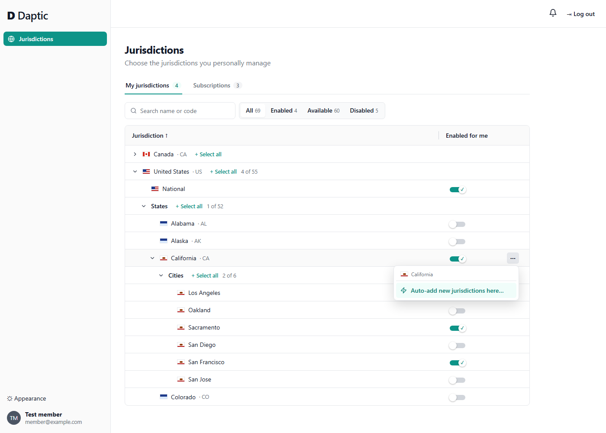
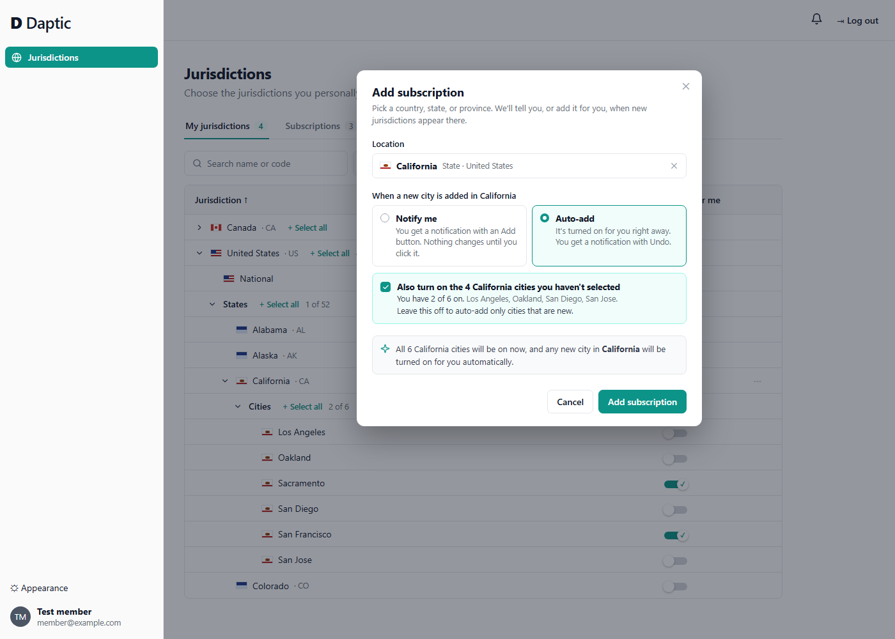
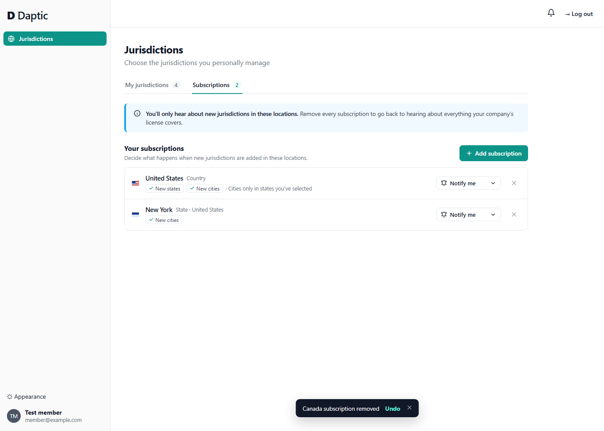
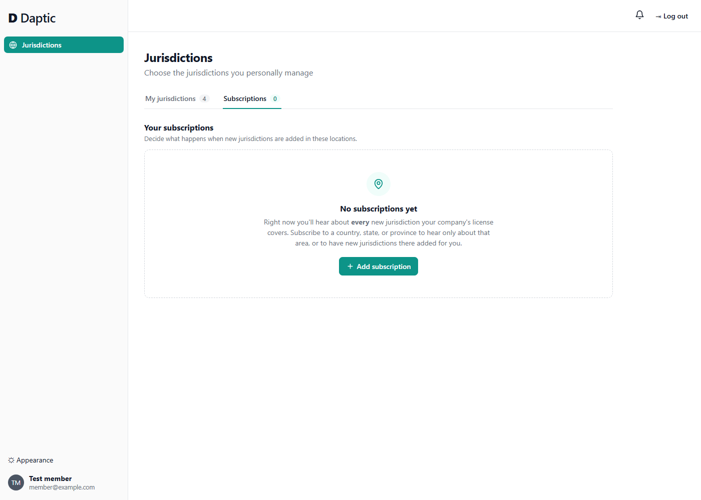

# Situation 1: New jurisdictions, summary of changes

## The changes

**1. Every new jurisdiction triggers a notification for users, if their company's license covers it**

- **What it says:** the new jurisdiction's name and where it sits, for example *San Jose (California, US)*.
- **The Add button:** **Add to my jurisdictions** turns on just that jurisdiction in the user's selections, in one click. They don't need to open the Jurisdictions screen or find it in the tree. Their other selections stay as they are, and they can turn it off later on the Jurisdictions screen like any other jurisdiction.
- **If they don't click Add:** nothing changes. Their saved settings mean what they always meant.
- **Mute:** users can turn new-jurisdiction notifications off completely. They can also limit them to certain areas using subscriptions, described next.

**2. A Subscriptions tab, to control what happens when jurisdictions are added in a location**

A subscription is a location (a country, state, or province) plus a few options:

| Option | Choices |
|---|---|
| **Action** | **Notify me** (a notification with the Add button) or **Auto-add** (turned on automatically, with a notification and Undo) |
| **Include** (countries only) | ☑ New states / provinces ☑ New cities |
| **Cities** (countries only) | ○ In every state ○ **Only in states I already have selected** |
| **Turn on the rest now** (Auto-add only) | ☐ Also turn on the jurisdictions here you haven't selected yet |

A state or province only has cities under it, so its subscription has no **Include** or **Cities** options: it always covers new cities.

**Turn on the rest now** is offered when the user picks *Auto-add* for a location they haven't fully selected. Auto-add exists so people don't have to keep turning jurisdictions on by hand, and this catches them up in the same step. It's a one-time change to their selections, not a setting that's saved, and it only turns on licensed jurisdictions.

- **Adding a subscription:**
    - On the **Subscriptions tab**, **Add subscription** opens a dialog: type a location name (*Unit…* → *United States*), then choose the options.
    - From the **⋯ menu** on a country or state row of the Jurisdictions tree, choose **Auto-add new jurisdictions here…**. It opens the same dialog with the location filled in and *Auto-add* chosen.
- **The "only in states I already have selected" option** follows the user's current choices: if they turn a state on later, its new cities start being covered too.
- **Limiting notifications to certain areas:** a user with any *Notify me* subscriptions hears only about jurisdictions those subscriptions cover. A user with none hears about every licensed new jurisdiction, unless muted.
- **Licensing still applies:** only jurisdictions the company's license covers are added automatically.

Example Subscriptions tab:

```
Subscriptions                          [ Add a location… ]

United States   Notify me  States ✓  Cities ✓ (only in states I have selected)
Canada          Auto-add   Provinces ✓  Cities ✓ (every province)
New York        Notify me  Cities ✓
```

## Mocks: the Subscriptions tab

The mocks are static: [img/designSpike1/prototype.html](img/designSpike1/prototype.html), one mock per `?mock=` value. None of the app's code was changed.

### 1. My subscriptions

Subscriptions is a second tab on the Jurisdictions page. Each row says, in words, what it covers (✓ *New states*, ✓ *New cities*, *only in states you've selected*). The action can be changed in place from the dropdown. **✕** removes the subscription.

The banner explains the side effect that's easiest to miss: having a subscription means you only hear about those locations.



### 2. Adding a subscription: choosing a location

Type any part of a name. Results are grouped by country and level, and the matching text is in bold. Cities aren't offered, and the footer says why. **Add subscription** stays disabled until a location is picked.



### 3. Adding a subscription: options

After a location is picked, the dialog shows the action as two cards that each describe what happens, the **Include** toggles, and a one-line summary of the result. *Only in states I've selected* lists the states that applies to right now. The defaults are the cautious ones: *Notify me*, with cities only in states you've selected.



### 4. Adding from the Jurisdictions tree

Country and state rows get a **⋯** button, shown on hover. Its menu has one item, **Auto-add new jurisdictions here…**, which opens the Add subscription dialog for that row. Cities and grouping rows (*States*, *Cities*) have no **⋯**, because they can't be subscribed to.



### 5. A state, with Auto-add

The dialog opens with *California* filled in and *Auto-add* chosen. A state has no **Include** options. Because only 2 of California's 6 cities are on, the dialog offers to turn on the other 4 now, and names them. The box is unticked by default because it changes existing selections; it's shown ticked here. The summary line updates to say what will happen.



### 6. Removing a subscription

**✕** removes it right away with no confirmation, and a toast offers **Undo**. It's quick to do and easy to reverse, so a confirmation dialog would only slow people down.



### 7. No subscriptions yet

The empty state says what happens today (you hear about everything) and why you'd add a subscription.



## How it works for each persona

**Jurisdiction holder** (responsible for a subset)

- Subscribes to their area, for example *California → Auto-add*. New jurisdictions there show up on their own.
- Because they have a subscription, notifications only cover their area, and nothing outside it reaches them.

**Jurisdiction manager** (manages a team, or works alone as a single operator)

- A team manager uses *Notify me* on their countries to see everything new and decide what to add.
- A single operator who wants everything uses *United States → Auto-add* and *Canada → Auto-add*, so "everything" now includes new jurisdictions.
- A single operator who deliberately left out some states uses *Cities: only in states I already have selected*. They get new states and new cities, but never cities in states they chose not to cover.

## The three cases

| Case | What happens |
|---|---|
| **All US states selected, Montana added** | **No subscription:** notification, and **Add** turns Montana on. **Subscribed to *United States*, new states included:** added automatically (*Auto-add*) or a notification (*Notify me*). |
| **California selected (Illinois not), San Jose added** | **No subscription:** notification, and **Add** turns San Jose on. **Subscribed to *United States* or *California*, new cities included:** covered, with either city option, because California is selected. Illinois doesn't matter. |
| **Alabama deselected, city added under Alabama** | **Subscribed to *United States* with *Cities: only in states I already have selected*:** not added and no notification, so the deselection is respected. **With *Cities: in every state*:** covered, because the user chose that, and Auto-add offers Undo. **No subscription:** notification only, and nothing changes. |

**Why "all states selected" isn't treated as a subscription:** selecting every state today says nothing about the future. A subscription is the user saying so explicitly, and its options say exactly how far it reaches.

## Why we didn't use the other approaches

| Approach | Why not |
|---|---|
| **A global auto opt-in switch, plus a rule about parents and siblings** (e.g. "all siblings selected means auto-add") | The rule is hidden and surprising. It breaks on grouping rows that can't be selected, and on countries without a "National" row. A subscription's options say the same thing explicitly. |
| **An auto opt-in checkbox on every jurisdiction** | Hundreds of checkboxes. A subscriptions list holds a few entries a user types in. |
| **Notifications sent only to users who seem related to the new jurisdiction** | The system would be guessing who wants what, and every guess risks surprising someone. Users choose what they hear through subscriptions instead. |
| **Admin-assigned owners for each branch of the tree** | Clear accountability, but it needs a new admin screen, a setup step, and handling for when owners leave, which is too much for this problem. It could build on subscriptions later, by letting a manager add subscriptions for their team. |
| **A flattened list where parents become tags, with subscriptions as saved tag filters** | Very flexible, but users would have to learn filter logic (AND/OR, exclusions), and the hierarchy people expect from geography would be lost. A location with a couple of options covers the real cases, including Alabama, with nothing new to learn. |
