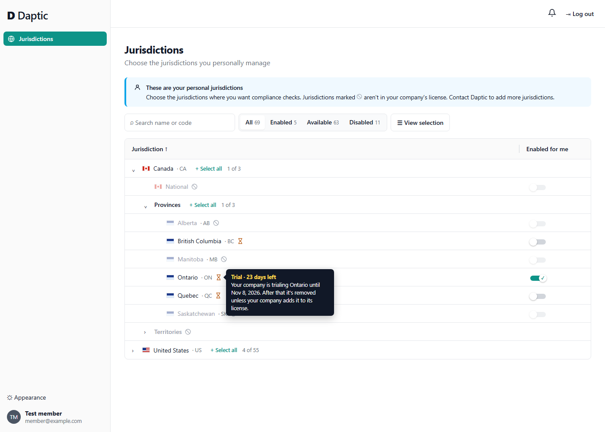
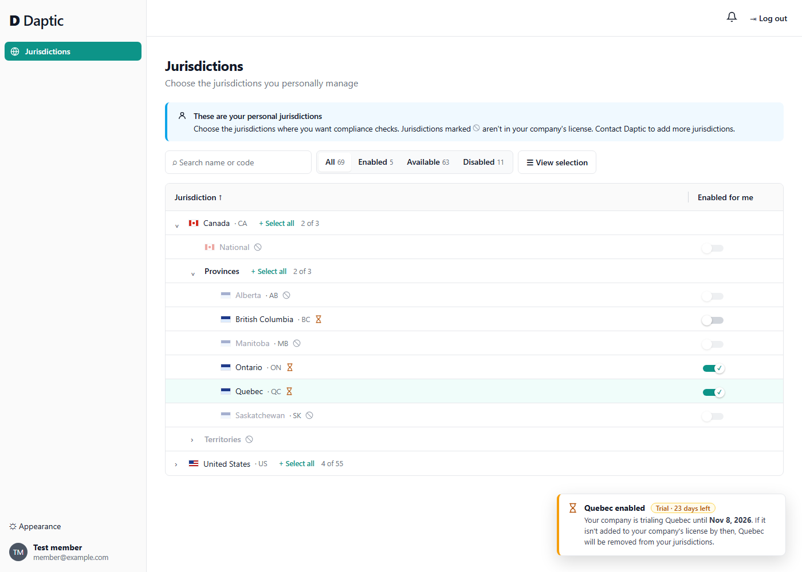
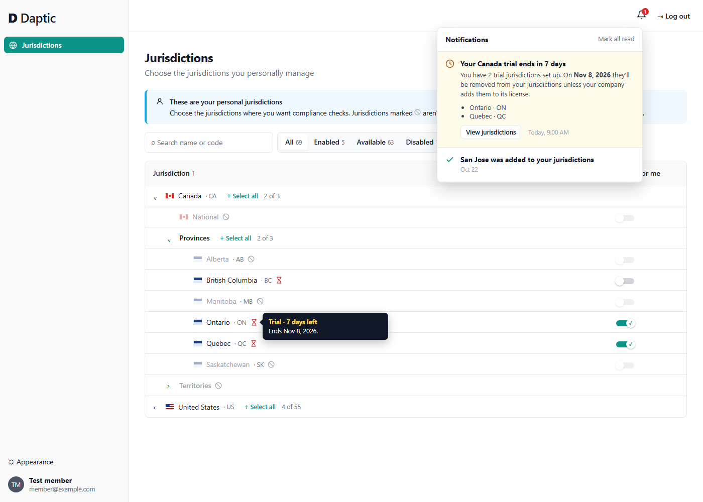
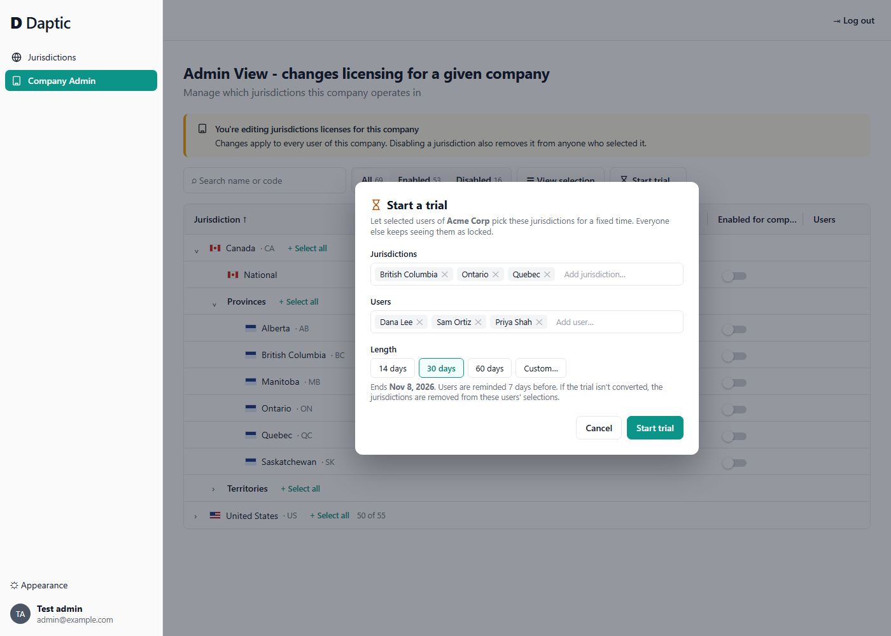
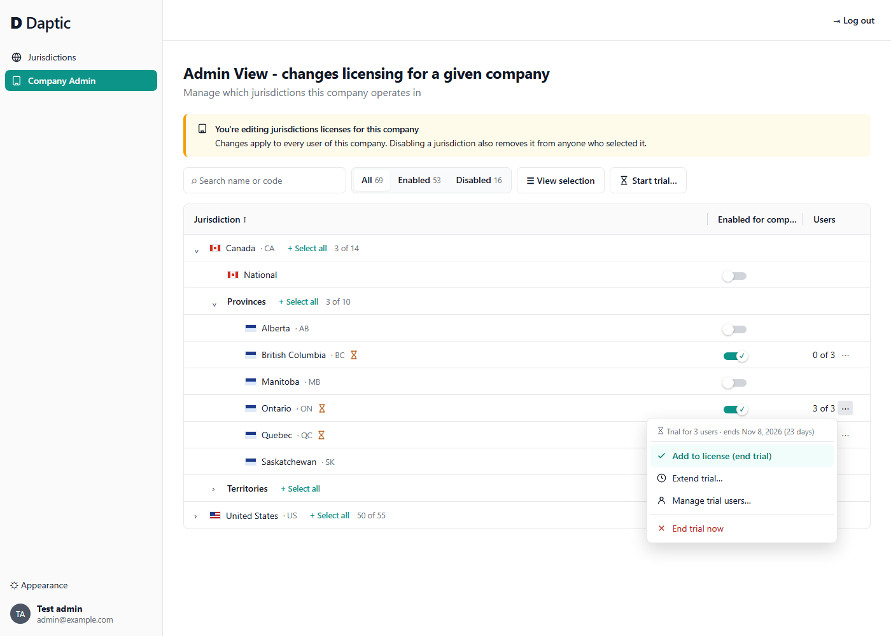

# Situation 2: Trialing a jurisdiction for a few users

## The idea

**A trial is a status on the company's license, not a new layer.** A licensed jurisdiction is either **available** (paid for) or **on trial** (with an end date and a list of trial users).

- **Trial users** can select trial jurisdictions like any other, and they get alerts for them as usual.
- **Everyone else in the company** sees no change: the jurisdiction stays locked ⊘ for them, the same as today.
- **A small hourglass icon** next to the name marks a trial jurisdiction. Its tooltip shows how many days are left. There is no new filter, tab, or banner: the trial only shows up where the jurisdiction does.

## How a trial ends

| Outcome | What happens |
|---|---|
| **The company buys it** | The admin changes it from *trial* to *available*. Nothing else changes: users keep their selections and alerts carry on without interruption. |
| **The company doesn't buy it** | At the end date the jurisdiction is removed from the license, and trial users lose it from their selections. This is the same thing that already happens when an admin disables a licensed jurisdiction. |
| **The admin ends it early** | Same as not buying it, but immediately. |

**No surprises:** users are told the trial is temporary twice before anything is removed:

1. **When they enable it.** The confirmation says *Trial · N days left* and what happens at the end.
2. **About 7 days before it ends.** Every trial user who has selected any trial jurisdiction gets a notification listing those jurisdictions and the end date. Trial users who never selected anything aren't notified, because they have nothing to lose.

## Mocks

The mocks are static: [img/designSpike2/prototype.html](img/designSpike2/prototype.html), one mock per `?mock=` value. None of the app's code was changed.

### 1. A trial jurisdiction in the user's tree

Ontario, Quebec, and British Columbia are on trial for this user, so they're selectable and marked with the hourglass. The rest of Canada is still locked. Hovering the icon shows the days left and the end date.

### 2. Enabling a trial jurisdiction

Turning on a trial jurisdiction shows how long it lasts and what happens if it isn't bought.

### 3. The 7-day reminder

The icon turns red in the last 7 days. Each trial user with selections gets one notification listing what they'll lose and when.

### 4. Admin: starting a trial

On the company licensing screen, **Start trial…** takes the jurisdictions, the users, and a length. The dialog says up front when it ends and what happens then.

### 5. Admin: the trial on the licensing screen, and converting it

Trial jurisdictions show the hourglass here too. **Users** shows how many trial users have selected each one (*3 of 3* chose Ontario, *0 of 3* chose BC), which is useful to sales when deciding what to offer. The row menu converts the trial (**Add to license**), extends it, changes who is in it, or ends it.

## How it fits the current model

- `CompanyJurisdiction` gets a `status` (`trial` | `available`) and a `trial_ends_at`. A small table lists the trial users for each trial row, and is removed with it.
- User selections stay in `UserJurisdiction`, so its foreign key to the company's license still holds:
    - **Converting a trial** updates one row.
    - **When a trial ends without a purchase**, the license row is deleted and the existing cascade removes users' selections.
- When a user turns on a trial jurisdiction, the selection service checks that they're one of its trial users.
- A daily job sends the 7-day reminders (once per trial) and removes expired trials. Alerts and selection checks also treat a trial past its end date as not licensed, so a late job run can't leak extra days.
- The UI reuses the existing row component, with a trial state and end date added as props. The icon, tooltip, and red state at 7 days or fewer are all part of that.

## Why we didn't use the other approaches

| Approach | Why not |
|---|---|
| **Trial as its own filter, tab, or section** | Puts the trial up front when it's really a property of a single jurisdiction. The icon and tooltip say the same thing in the place users are already looking. |
| **Keep users' selections after a failed trial, shown as "paused"** | Adds a state nobody asked for and keeps stale selections around. Users are warned twice, and losing the jurisdiction is the honest outcome. |
| **Unlock the jurisdiction for the whole company during the trial** | That's not what the customer asked for. Only a few users are evaluating, and the rest of the org shouldn't see coverage the org hasn't decided on. |
| **A separate trial-selections table, promoted into the license on purchase** | Keeps a parallel copy of selections and adds a migration step at purchase time. A status on the license row makes converting a trial a one-field change. |
